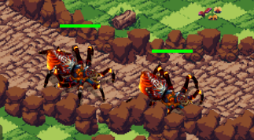
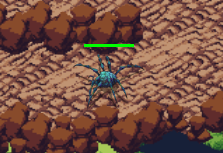
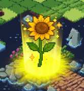
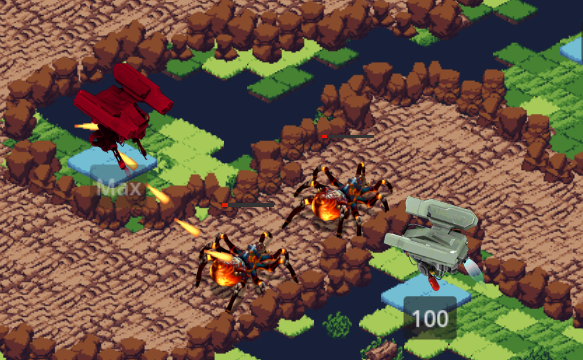
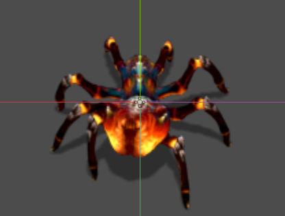
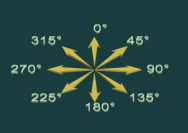
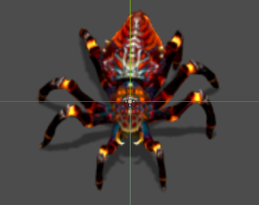

# Protect The Flower

**Créé par : Alex Marcouiller**

## Introduction

Protect The Flower est un Tower Defense où le joueur doit empêcher des vagues infinies d’araignées d'atteindre la base.  
Le joueur gagne de l’or en éliminant les ennemis afin de placer de nouvelles tours ou améliorer celles déjà présentes.  
Le but est de survivre le plus longtemps possible et battre le meilleur score.

---

## Concepts utilisés dans le projet

### 1. Système de vagues infinies (World.gd)

Les ennemis arrivent par vagues, chacune plus difficile que la précédente.  
Le système repose sur un cycle automatique :

1. Une vague apparaît.
2. Le joueur élimine tous les ennemis.
3. Lorsque le groupe `"enemies"` est vide, un compte à rebours démarre.
4. Une nouvelle vague est générée et le niveau augmente.
5. Le processus se répète indéfiniment tant que le joueur survit.

```gdscript
func _process(delta):
    var enemies = get_tree().get_nodes_in_group("enemies")

    # Quand il ne reste plus d'ennemis en vie, on prépare la prochaine vague
    if enemies.size() == 0:
        _time_until_next_wave -= delta
        if _time_until_next_wave <= 0:
            _start_next_wave()
```




La fonction \_start_next_wave() augmente l'indice de vague, met à jour l'affichage et lance la génération des araignées.
Elle calcule le nombre d'ennemis en fonction de la vague et les fait apparaître un par un avec un délai pour garder un rythme naturel.

```gdscript
var spiders_to_spawn: int = base_spiders_per_wave + (wave - 1) * spiders_per_wave_increment

for i in range(spiders_to_spawn):
    spawn_spider()
    await get_tree().create_timer(spawn_delay_between_spiders).timeout

```

De plus, toutes les X vagues, un boss apparaît. La difficulté augmente avec le nombre de boss et leur vitesse qui augmente avec wave_index.

```gdscript
if boss_every > 0 and wave % boss_every == 0:
    spawn_spider_boss()

```

Ce système crée un mode survie illimité où les vagues deviennent progressivement plus difficiles jusqu’à ce que la fleur soit atteinte.



**Source (Système de vagues infinies)**

- [Documentation Godot – Node Groups](https://docs.godotengine.org/en/stable/classes/class_node.html#groups)

### 2. Système de tours et tir automatique des projectiles (tower.gd)

Les tours s’occupent automatiquement de repérer et attaquer les ennemis.  
À intervalles réguliers, elles recherchent l'ennemi le plus proche dans leur portée puis tirent un projectile qui se dirige vers lui.

Le fonctionnement se fait en trois étapes :

1. La tour scanne toutes les araignées dans le groupe `"enemies"`.
2. Elle choisit la cible la plus proche dans un rayon défini (`range`).
3. Lorsque le cooldown est terminé, elle tire un projectile vers celle-ci.

```gdscript
func _find_target() -> Node2D:
    var enemies = get_tree().get_nodes_in_group("enemies")
    var closest: Node2D = null
    var best_dist: float = range

    for e in enemies:
        var dist: float = global_position.distance_to(e.global_position)
        if dist < best_dist:
            best_dist = dist
            closest = e

    return closest
```

Lorsque la tour a une cible valide et que le temps de recharge est écoulé, elle crée un projectile et le place dans la scène :

```gdscript
func _shoot() -> void:
    var p: Node2D = projectile_scene.instantiate()
    get_tree().current_scene.add_child(p)
    p.global_position = global_position

    if "target" in p:
        p.target = target
```

Le projectile suit ensuite l'ennemi et applique des dégâts lorsqu'il le touche.
Plus le joueur améliore ses tours, plus le fire_rate augmente, ce qui permet des tirs plus rapides.

Le joueur peut placer des tours, les améliorer et observer comment elles gèrent automatiquement les vagues d’ennemis.

**Source (Tours + tir automatique)**

- [Documentation Godot – PackedScene.instantiate()](https://docs.godotengine.org/en/stable/classes/class_packedscene.html)
- [Documentation – Premier jeu 2D (instanciation & nodes)](https://docs.godotengine.org/en/stable/getting_started/first_2d_game/index.html)



### 3. Déplacement des ennemis avec Path2D / PathFollow2D (spider.gd, World.gd)

Les ennemis ne se déplacent pas librement : ils suivent un chemin prédéfini dans la scène grâce au système **Path2D + PathFollow2D** de Godot.

Dans la scène, on place un node `Path2D` qui représente le chemin (la route que suivent les araignées).  
Chaque araignée est une instance de `PathFollow2D` qui se déplace le long de ce chemin en faisant avancer sa propriété `progress`.

Dans `World.gd`, lors du spawn d'une araignée, on l’ajoute comme enfant du `Path2D` et on initialise sa progression :

```gdscript
func spawn_spider() -> void:
    var s := spider_scene.instantiate()
    path.add_child(s)

    if s is PathFollow2D:
        (s as PathFollow2D).progress = 0.0

    if "world_ref" in s:
        s.world_ref = self
```


Ensuite, dans spider.gd, le script de l’ennemi fait avancer l’araignée le long du chemin :

```gdscript
extends PathFollow2D

@export var base_speed: float = 150
var speed: float = 150

func _process(delta: float) -> void:
    if is_dying:
        return

    progress += speed * delta

    if progress_ratio >= 1.0:
        if world_ref and world_ref.has_method("game_over"):
            world_ref.game_over()
        queue_free()
```

- `progress` contrôle la position de l’ennemi sur le chemin.
- `progress_ratio` varie entre **0.0 (départ)** et **1.0 (arrivée)**.
- Lorsque `progress_ratio >= 1.0`, l’araignée atteint la base du joueur :
  - la fonction `game_over()` est déclenchée
  - l’ennemi est supprimé de la scène (`queue_free()`)

**Avantages du système Path2D / PathFollow2D :**

- Permet de **dessiner visuellement le chemin** dans l’éditeur Godot via `Path2D`
- Gère **la vitesse des ennemis facilement** (`speed` modifiable selon la vague ou type d’araignée)
- Assure un comportement cohérent :
  - toutes les araignées **suivent la même trajectoire**
  - mais peuvent **avancer à des vitesses différentes**

**Source (Déplacement Path2D / PathFollow2D)**

- [Documentation officielle PathFollow2D](https://docs.godotengine.org/en/stable/classes/class_pathfollow2d.html)
- [Movement along a path – Exemple Godot](https://docs.godotengine.org/en/stable/tutorials/2d/2d_movement.html#following-paths)

### 4. Logique d’animation directionnelle des araignées (spider.gd)

Les araignées possèdent plusieurs animations différentes selon la direction dans laquelle elles se déplacent.  
L’objectif est que l’ennemi **regarde et avance dans la bonne direction** en fonction de son mouvement réel sur le chemin.

Dans `spider.gd`, on commence par calculer le vecteur de déplacement entre deux frames :

```gdscript
func _process(delta: float) -> void:
    if is_dying:
        return

    progress += speed * delta

    var current_pos: Vector2 = global_position
    var move: Vector2 = current_pos - _last_global_pos

    if move.length() > 0.1:
        _update_direction_animation(move)

    _last_global_pos = current_pos
```

La fonction \_update_direction_animation(dir) se charge ensuite de choisir la bonne animation en fonction de la direction :

```gdscript
func _update_direction_animation(dir: Vector2) -> void:
    if body == null:
        return

    var angle: float = rad_to_deg(atan2(dir.y, dir.x))
    if angle < 0.0:
        angle += 360.0

    var step: float = 45.0
    var index: int = int(round(angle / step)) % 8
    var snapped_angle: int = index * int(step)
    var anim_name := "run_%d" % snapped_angle

    if body.sprite_frames.has_animation(anim_name) and body.animation != anim_name:
        body.play(anim_name)

    if shadow and shadow.sprite_frames.has_animation(anim_name) and shadow.animation != anim_name:
        shadow.play(anim_name)
```

**Logique utilisée :**

- On récupère l’angle du vecteur de déplacement avec `atan2(dir.y, dir.x)` puis on le convertit en degrés (`rad_to_deg`).
- On normalise l’angle pour qu’il soit dans l’intervalle **[0°, 360°)**.
- On découpe le cercle en **8 directions** grâce à `step = 45.0` :
  - **0°, 45°, 90°, 135°, 180°, 225°, 270°, 315°**
- On arrondit l’angle au multiple de 45° le plus proche (**snapped_angle**) pour savoir dans quel “secteur” l’ennemi se déplace.
- On construit le nom de l’animation sous la forme :
  run_0, run_45, run_90, …, run_315

- Si cette animation existe dans le `SpriteSheet`, on la joue pour `body` et, s’il existe, pour `shadow`.

**Exemples :**

| Direction approximative | Angle calculé | Animation jouée |
| ----------------------- | ------------- | --------------- |
| Vers le haut            | ≈ **0°**      | `run_0`         |
| Haut → droite diagonal  | ≈ **45°**     | `run_45`        |
| Vers la droite          | ≈ **90°**     | `run_90`        |
| Vers la gauche          | ≈ **270°**    | `run_270`       |

Cela permet à l’araignée de **tourner automatiquement selon son mouvement**, ce qui rend l’animation plus fluide, lisible et réaliste pendant le jeu.





**Source (Animations directionnelles)**

- [KCC - 8-Directional Movement/Animation](https://kidscancode.org/godot_recipes/4.x/2d/8_direction/index.html)
- [Documentation Godot – Math vectorielle & angles](https://docs.godotengine.org/en/stable/tutorials/math/vector_math.html#angles)

### 5. Barre de vie dynamique et couleur selon la vie (spider.gd)

Les araignées possèdent une barre de vie affichée au-dessus d’elles.  
La barre rétrécit proportionnellement aux points de vie restants, ce qui permet au joueur de visualiser facilement l’état d'un ennemi.

```gdscript
var ratio = clamp(health / max_health, 0.0, 1.0)
health_bar_fg.size.x = _health_bar_full_width * ratio
health_bar_fg.color = Color(1.0 - ratio, ratio, 0.0)
```

| Vie restante              | Couleur          |
| ------------------------- | ---------------- |
| Haute (ratio proche de 1) | **Vert**         |
| Moyenne                   | **Jaune/Orange** |
| Basse                     | **Rouge**        |

Cela améliore la lisibilité du combat et le feedback visuel.

**Source (Health Bar)**

- [Godot - ColorRect ](https://docs.godotengine.org/en/stable/classes/class_colorrect.html)

### 7. Menu Pause fonctionnel même lorsque le jeu est stoppé (pause_menu.gd)

Lorsque le joueur appuie sur **ESC**, un menu apparaît et le `get_tree().paused = true` stoppe le gameplay.  
Les boutons UI restent fonctionnels grâce à `process_mode = ALWAYS`.

```gdscript
func open_menu():
    is_open = true
    visible = true
    get_tree().paused = true
```

Fonctionnalités du menu pause :

- Reprendre la partie

- Retour au menu principal

- Ajuster la musique / SFX

**Source (Menu Pause)**

- [Godot - Pausing games and process mode ](https://docs.godotengine.org/en/stable/tutorials/scripting/pausing_games.html)
